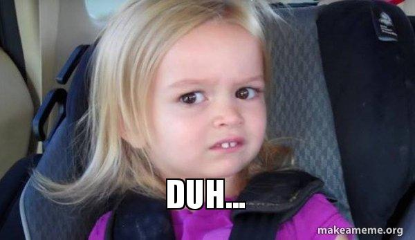
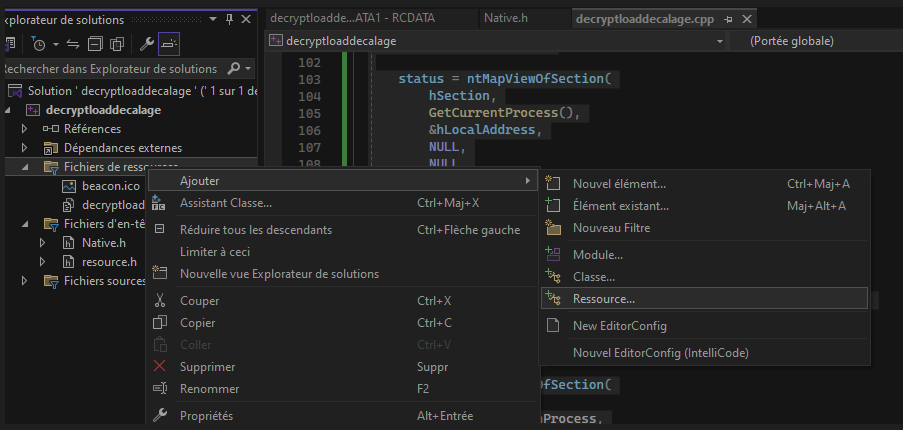
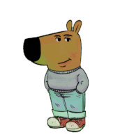

# RC-Obfuscator  
Just an obfuscation technique in a resource file in 2 possible formats   
1. **ICO** - Conversion of a binary file into an ico file (without the header) and loading of this file with ntmapViewOfSection Technique.  
2. **BITMAP** - Create a Bitmap file, inject the paylaod bin into the file and load it with ntmapViewOfSection Technique.  

# Prerequisite
Binary shellcode...  
.  
.  
.  
.  
...   

## Usage ICO  
1. Use the `Inconvert.exe` with shellcode bin file as argument and the output with ico extension.
2. Load this output file in `Ico.cpp` like ressources in visual studio you can make like that :
<p align="center">
  
</p>  

## Usage Bitmap
Look's like the ICO method but in this case we will create bitmap file or use existing bitmap file.  
1. Use the `CreateBitmap.exe` this exe will create a bitmap file.
2. Use `BitmapInsert.exe` with argument bmp file and the binary file. This will inject our shellcode encoded into the bitmap file.
3. Load this output file in `BMP.cpp`  like ressources.

> [!NOTE]  
> The bitmap methodology is more OPSEC because it doesn't touch the bitmap file to the point of making it unreadable, we can still visualize it we've just added our shellcode with delimiters at the end but in reality I've left it like that so you can simply define how you want to integrate it you could split it into several pieces or integrate it right in the middle of the file.


## Services  
In this two methods I also added service format of ico and bitmap technique, this allows you to use your payload as a service, so you can start it, stop it...etc.  
```exemple
sc create serviceBmpICO binPath= C:\THIS\IS\THE\PATH\OF.exe start= demand | auto
sc start serviceBmpICO
```
> [!NOTE] 
> Based on RedefiningReality repo https://github.com/RedefiningReality/Cobalt-Strike  
> I put respect on his name.  


> [!CAUTION] 
> This is just a POC so you're nice you keep your hands in your pockets and chill unless it's your lab.   
